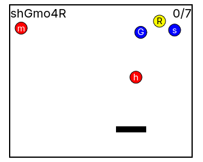

# ctc (Catch The Captcha)

Captchas but fun :-)

Inspired by [osu!ctb](https://osu.ppy.sh/wiki/en/Game_mode/osu%21catch)



# Build

Server:
```sh
cd server/ && cargo build
./target/debug/server
```

Client:
```sh
open client/index.html
```
